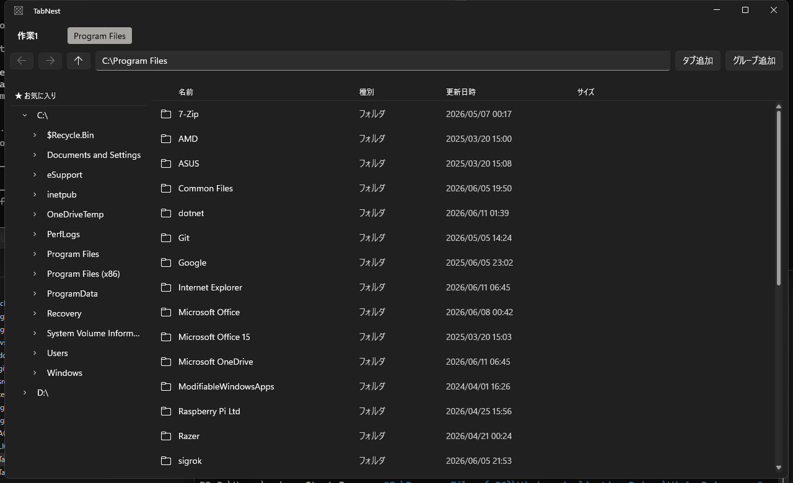

# TabNest

タブとタブグループでフォルダを整理できる、Windows 11 向けのタブ型ファイラーです。
WinUI 3(Windows App SDK)+ .NET 10 で実装しています。



## 主な機能(v0.1)

- フォルダ内容の詳細表示(名前・種別・更新日時・サイズ、列ソート、列幅自動調整)
- 戻る・進む・上へ・アドレスバー移動(タブごとに独立した履歴)
- タブ(追加: ボタン / `Ctrl+T`、選択、ホイールクリックで閉じる、`Ctrl+Shift+T` で復元)
- タブグループ(最小1段〜最大5段、追加: ボタン / `Ctrl+G`、ダブルクリックでリネーム)
- お気に入り(グループ名の右クリックで保存、左カラムから新しい段として開く)
- 左カラムのフォルダツリー(クリックでアクティブタブを移動)
- セッション保存・復元(タブ構成・アクティブタブ・閉じたタブ履歴・ウィンドウサイズ・左カラム幅)

詳細仕様は [docs/SPEC.md](docs/SPEC.md) を参照してください。

## 動作環境・前提

- Windows 11
- [.NET 10 SDK](https://dotnet.microsoft.com/)(10.0.301 で検証済み)
- 開発者モード(設定 → システム → 開発者向け)
  ※ パッケージアプリの登録・UI テストに必要

## ビルドと実行

```powershell
git clone https://github.com/in0ho1no/TabNest.git
cd TabNest

# ビルド(ソリューション単位)
dotnet build TabNest.slnx

# 実行(初回はパッケージ登録も行われる)
dotnet run --project src/TabNest.App/TabNest.App.csproj -p:Platform=x64
```

- ソリューションは `.slnx`(.NET 10 新形式)です。`.sln` はありません
- Release ビルドは `dotnet build TabNest.slnx --configuration Release`

## テスト

```powershell
# 単体テスト・結合テスト・UIテストをまとめて実行
dotnet test TabNest.slnx
```

| プロジェクト | 内容 |
|---|---|
| `tests/TabNest.Core.Tests` | Model・Service の単体テスト |
| `tests/TabNest.ViewModels.Tests` | ViewModel の単体テスト(WinUI 非依存) |
| `tests/TabNest.Integration.Tests` | 一時フォルダでの実ファイル操作を伴う結合テスト |
| `tests/TabNest.UiTests` | WinAppDriver + Appium による GUI 自動テスト |

UI テストは **WinAppDriver が起動していない場合は自動的にスキップ**されるため、
`dotnet test TabNest.slnx` は WinAppDriver なしでも成功します(CI でも同様)。

## UI テスト(GUI 自動テスト)

WinAppDriver のインストール・起動、テスト対象アプリの登録、AUMID の上書き、
トラブルシューティングを含む詳細手順は
[tests/TabNest.UiTests/README.md](tests/TabNest.UiTests/README.md) を参照してください。

```powershell
# 1. WinAppDriver を起動する(別ターミナル。環境によっては管理者権限が必要)
Start-Process "C:\Program Files (x86)\Windows Application Driver\WinAppDriver.exe"

# 2. テスト対象アプリのパッケージを登録する(初回・ビルド更新後)
dotnet run --project src/TabNest.App/TabNest.App.csproj -p:Platform=x64

# 3. UI テストを実行する
dotnet test tests/TabNest.UiTests/TabNest.UiTests.csproj
```

## 開発支援スキル(Claude Code)

このリポジトリは、Claude Code で WinUI 3 開発用スキル(Microsoft 公式
[win-dev-skills](https://github.com/microsoft/win-dev-skills)・MIT)をこのプロジェクト配下に限定して有効化する設定を同梱しています。
グローバル環境(`~/.claude/`)は汚さず、依存はリポジトリで追跡されます。

設定の実体は [`.claude/settings.json`](.claude/settings.json) です。

新しく環境を作る場合の手順:

1. リポジトリを clone する。
2. このフォルダで Claude Code を起動する。
   起動時にマーケットプレイスを GitHub から取得する
   (信頼確認プロンプトが出た場合は承認する。環境によっては表示されないこともあります)。
3. 取得後、`winui` プラグイン同梱のスキル(`winui-dev-workflow` /
   `winui-design` / `winui-code-review` / `winui-ui-testing` /
   `winui-packaging` / `winui-wpf-migration` / `winui-setup` /
   `winui-session-report`)と orchestrator agent が利用可能になる。

取得先(キャッシュ)は グローバル側 の
`~/.claude/plugins/marketplaces/win-dev-skills/` です
(プロジェクト配下には展開されません)。スキルが一覧に出ない場合は、
信頼プロンプトの承認漏れか取得失敗を疑い、Claude Code を再起動して確認してください。

> 注: 別途 `claude plugin marketplace add microsoft/win-dev-skills` を手動実行する必要はありません。
> そのコマンドはマーケットプレイスをグローバルに登録し全プロジェクトへ影響するため、
> 本リポジトリでは上記の宣言的設定(プロジェクト限定)を採用しています。

## 既知の制限(v0.1)

- ファイル操作(コピー・移動・削除・リネーム・新規作成)は未実装(v0.2 以降)
- 検索・フィルタ機能はありません
- シングルウィンドウのみ(多重起動した場合、セッションは最後に閉じたウィンドウの状態で保存されます)
- ファイル一覧のアイコンは Segoe Fluent Icons のグリフによる区別のみ(Shell アイコンは未取得)
- ソート方向のインジケータ(▲▼)は表示しません(v0.1 仕様の対象外)
- お気に入りのリネーム・並び替え・上書き更新は未対応(削除して保存し直す運用)
- タブごとの戻る・進む履歴はアプリ再起動で失われます(仕様)
- パッケージアプリのため、設定ファイル(`%AppData%\TabNest\settings.json`)の実体は
  `%LocalAppData%\Packages\<PackageFamilyName>\LocalCache\Roaming\TabNest\settings.json` に保存されます

## プロジェクト構成

```text
src/
  TabNest.App/          WinUI 3 エントリポイント・View
  TabNest.ViewModels/   ViewModel 層(WinUI 非依存)
  TabNest.Core/         Model・Service・Interface
tests/
  TabNest.Core.Tests/         Core 単体テスト
  TabNest.ViewModels.Tests/   ViewModel 単体テスト
  TabNest.Integration.Tests/  結合テスト
  TabNest.UiTests/            GUI 自動テスト(WinAppDriver + Appium)
docs/
  SPEC.md               仕様・タスク分割(正)
  reviews/              タスクごとのクロスモデルレビュー記録
  images/               スクリーンショット
```

開発フロー(ブランチ運用・コミット・レビュー)は [AGENTS.md](AGENTS.md) を参照してください。
